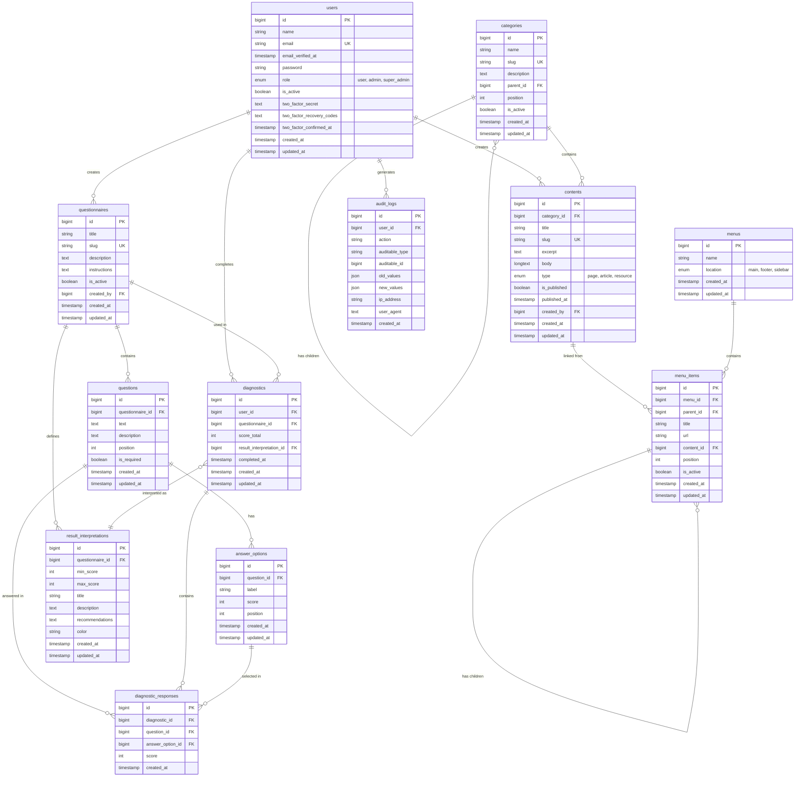
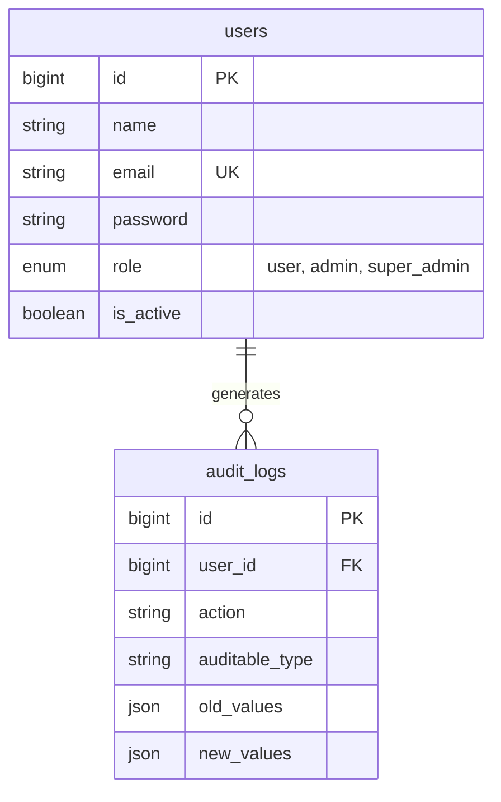
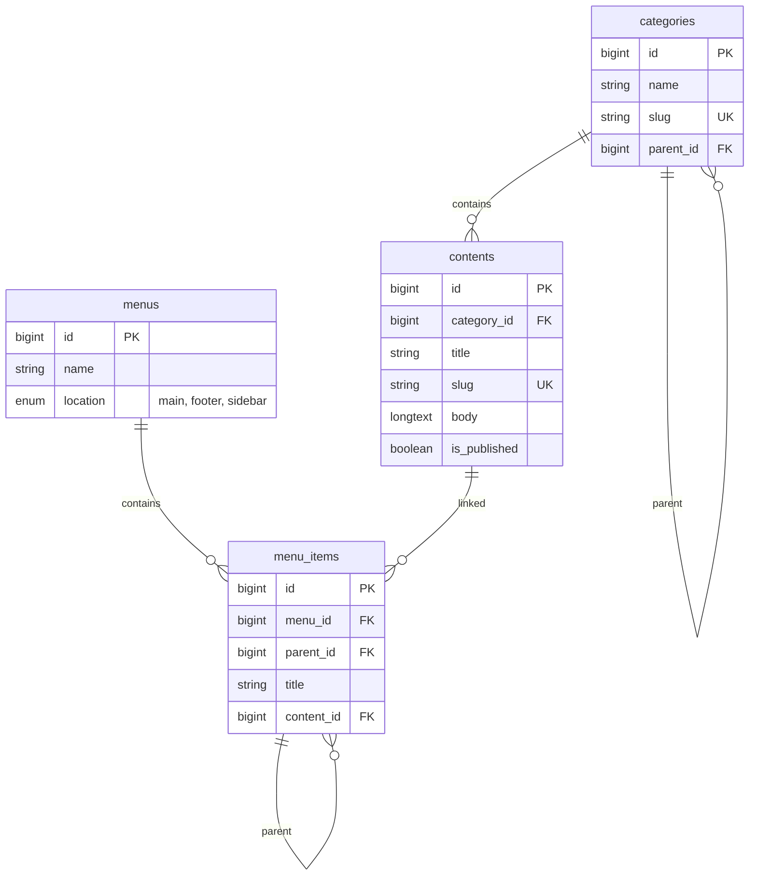
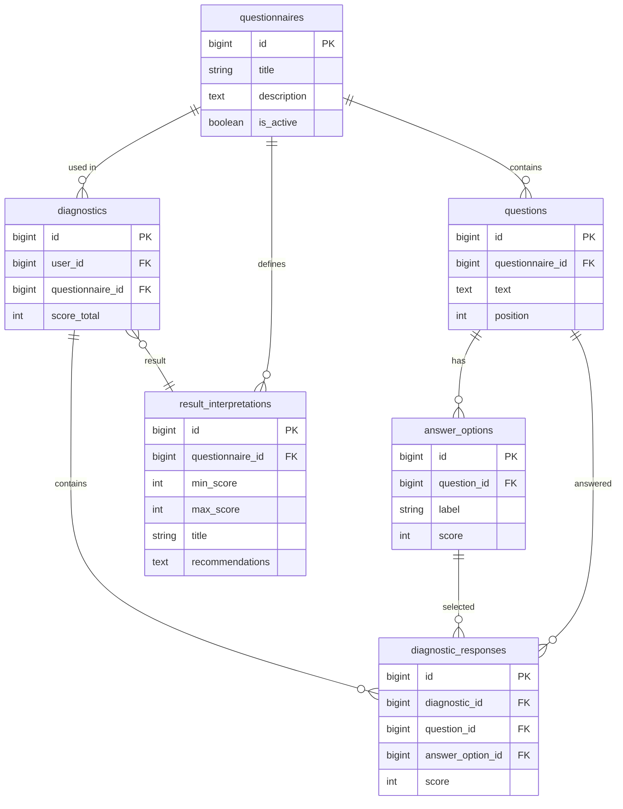
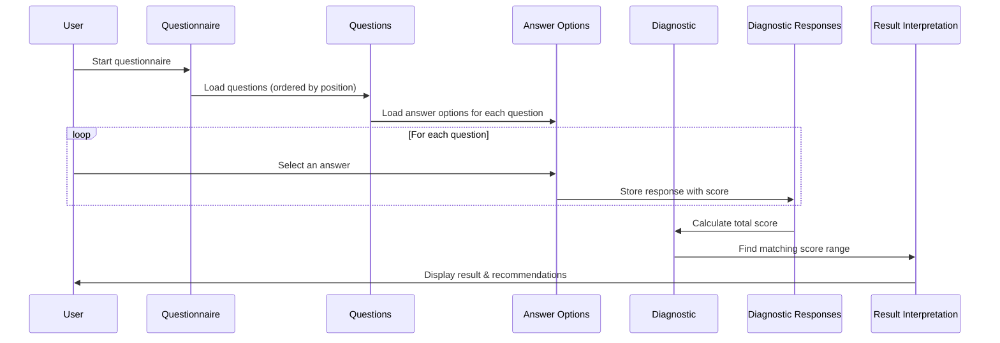

# CESIZen Database Schema

## Entity Relationship Diagram

## Simplified View by Module

### User Management

### Content Management

### Diagnostic Module (Core Feature)

## Example Data Flow

### How a Diagnostic Works

## Tables Summary

| Module | Table | Purpose |
|--------|-------|---------|
| **Users** | `users` | User accounts with roles |
| **Users** | `audit_logs` | Security logging |
| **Content** | `categories` | Content organization |
| **Content** | `contents` | Information pages |
| **Content** | `menus` | Navigation menus |
| **Content** | `menu_items` | Menu entries |
| **Diagnostic** | `questionnaires` | Stress questionnaires |
| **Diagnostic** | `questions` | Questions in questionnaire |
| **Diagnostic** | `answer_options` | Possible answers with scores |
| **Diagnostic** | `result_interpretations` | Score range meanings |
| **Diagnostic** | `diagnostics` | Completed questionnaires |
| **Diagnostic** | `diagnostic_responses` | User's answers |

## Key Improvements Over Original Schema

1. **Proper scoring system**: Questions have multiple `answer_options`, each with its own score
2. **Response tracking**: `diagnostic_responses` stores every answer the user gave
3. **Result configuration**: `result_interpretations` allows admins to define what score ranges mean
4. **Content hierarchy**: `categories` with `parent_id` for nested organization
5. **Navigation**: `menus` and `menu_items` for configurable navigation
6. **Audit trail**: `audit_logs` for RGPD compliance and security
7. **Soft delete**: `is_active` flags instead of hard deletes
